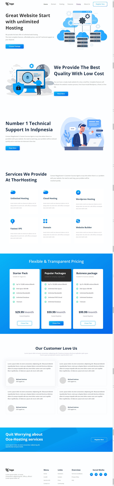

# Assignment 11

## Project 11 [Live Link](https://nachiketkeripaleproject11.netlify.app/)

- Build this project from strach.
- Used Flex and positions in this project.
- Learnt to align multiple section with multipe tags inside.
- Used svg files.
- Used Goolge Fonts for this project.

---

## Time taken to finish this project

-   8 hour to complete it.

#### Screenshot

 

